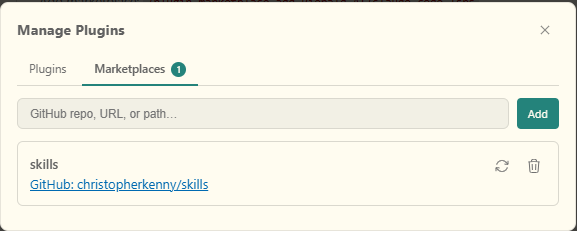
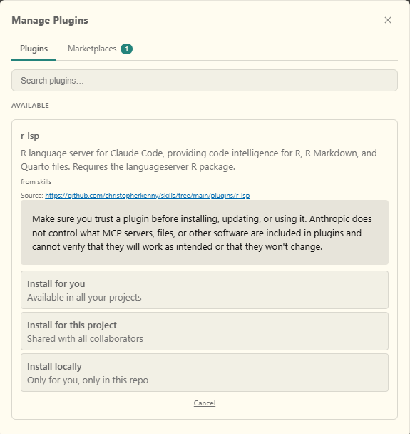

Claude Code recently added support for the [Language Server Protocol](https://microsoft.github.io/language-server-protocol/) (LSP), which changes how the tool interacts with a codebase.
In general, Claude navigates by searching text.
With an LSP, it can jump to definitions, find all references to a symbol, and receive live diagnostics as it edits files.
To use it, you need an LSP for your language (today: *R*).
One choice that works is the [`languageserver`](https://github.com/REditorSupport/languageserver) package.

An LSP provides autocompletion, inline diagnostics, and go-to-definition features.
If you use an IDE, like RStudio or Positron, this is probably the behavior you're used to as a human code writer, even if you haven't thought about it before.
The LSP is the implementation of a standard that separates the tooling from the editor.
The benefit is that any tool that implements the full protocol can use the same underlying server.

Ideally, I would write this to support [ark](https://github.com/posit-dev/ark), Posit's R kernel+LSP that's used in Positron.
At the moment, I don't believe it can be decoupled and used directly for this, based on some of the open issues on GitHub.
As such, this post covers using `languageserver` in the meantime.

The benefit is that once it's connected, Claude Code can use LSP operations *as it goes* rather than text search when working with your code.
It can jump to where a function is defined rather than guessing from context, find every call site for a symbol across the project, and see diagnostics immediately when it edits a file.
This is most useful in larger codebases where functions are spread across many files, or where understanding a piece of code requires tracing through several layers of function calls.
In theory, this should reduce the cases where pieces of an update are missed, since it will get tool-based feedback.

## Setup

Install the `languageserver` R package:

```r
install.packages('languageserver')
```

LSP support in Claude Code is not enabled by default.
Add `ENABLE_LSP_TOOL` to your global user settings file (`~/.claude/settings.json` on macOS/Linux, `C:/Users/<username>/.claude/settings.json` on Windows), creating the file if it does not exist:

```json
{
  "env": {
    "ENABLE_LSP_TOOL": "1"
  }
}
```

Then install the plugin from my [christopherkenny/skills](https://github.com/christopherkenny/skills) marketplace.
You can also download (and optionally edit) the files for the plugin and install locally.

To install the plugin with the Positron or VSCode extension:

1. Type `/plugins` -> Manage Plugins
2. Tab over to "marketplace"
3. Enter "christopherkenny/skills". It should then look like:



4. Go to the Plugins tab and select `r-lsp`. You can now pick global versus per project:



5. Restart Claude Code after installing.


If you're using the terminal:

1. Run the following:

```bash
claude plugin marketplace add christopherkenny/skills
claude plugin install r-lsp@christopherkenny/skills
```
2. Restart Claude Code after installing.

## Verifying it works

The LSP works passively: when Claude edits an `.R` file, the language server analyzes the result and pushes diagnostics back automatically.
You do not need to ask for it explicitly.
If `lintr` is installed, you will also get linting feedback alongside the language server's own warnings.[^1]

[^1]: If you don't like this, you may need to uninstall `lintr` with `remove.packages('lintr')` and try [jarl](https://jarl.etiennebacher.com/). I did not see any effect of changing my Positron settings on the `lintr` warnings for my use of my preferred `'` single quotes.

To confirm the server started correctly, check the debug log after launching Claude Code and look for:

```
LSP server plugin:r-lsp:r initialized
LSP server instance started: plugin:r-lsp:r
```

If you're using the terminal, you should be able to check with `claude --debug`.
In Positron or VS Code, open the Claude Code extension log via the Output panel.
To see the output panel: `ctrl+shift+P` -> "View: Toggle Output" -> select "Claude VSCode" from the dropdown.

That's it.
It *should* just work.
To see plugins for other languages, search "lsp" [on Anthropic's official plugins GitHub](https://github.com/anthropics/claude-plugins-official/tree/main/plugins).
