In an ideal world, everyone would just use PowerPoint.
Since that doesn't seem to be happening, this post introduces `dais`, a new PDF slide presentation tool.
You get a PowerPoint-esque presenting feel with a speaker view, but use your Beamer (or Polylux) slides.
The speaker view includes a preview of the next slide, making it easier for your talk to come across as well-rehearsed.

{width="50%" fig-align="center"}

The goal of `dais` is to have a portable, truly configurable presenter tool.
Most everything is configurable from keybindings to pointer styles.
It's feature rich, including:

- Draw on slides or use a freehand whiteboard
- Edit live text boxes with full math support
- Write speaker notes to yourself
- Track time spent on each slide
- Set a countdown timer
- Zoom into slides or spotlight a region
- Blackout or freeze the audience view while you navigate
- Jump to a specific slide by number

This is not the first PDF presenter tool.
[pdfpc](https://pdfpc.github.io/) is a popular choice, but does not work on Windows without WSL.
[pympress](https://github.com/Cimbali/pympress) is also popular and works on Windows, but requires Python, so I won't use it out of principle.
`dais` is built in Rust so it's fast and makes use of some very new and very cool tools, like [Typst](https://typst.app/) and [`hayro`](https://github.com/LaurenzV/hayro).[^1]

[^1]: You may know that I am not an expert in Rust and so much of this tool is vibe-coded. I started with a proposal document, several rounds of back-and-forth prompting until I had a proof-of-concept. Since then, I've been refining the interface and adding features, with hundreds of iterations of human testing.

## Basic use

Open a PDF with:

```bash
dais presentation.pdf
```

With two monitors, `dais` opens a presenter console on your primary display and puts the audience view fullscreen on the secondary display.
The console shows the current slide, a preview of the next, an editable notes panel, and a timer:

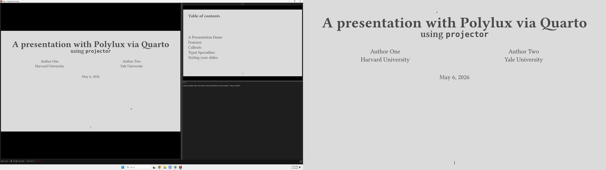

For single-monitor use, `dais --single` keeps everything in one window.
Press  to toggle between the console and a full-screen HUD.

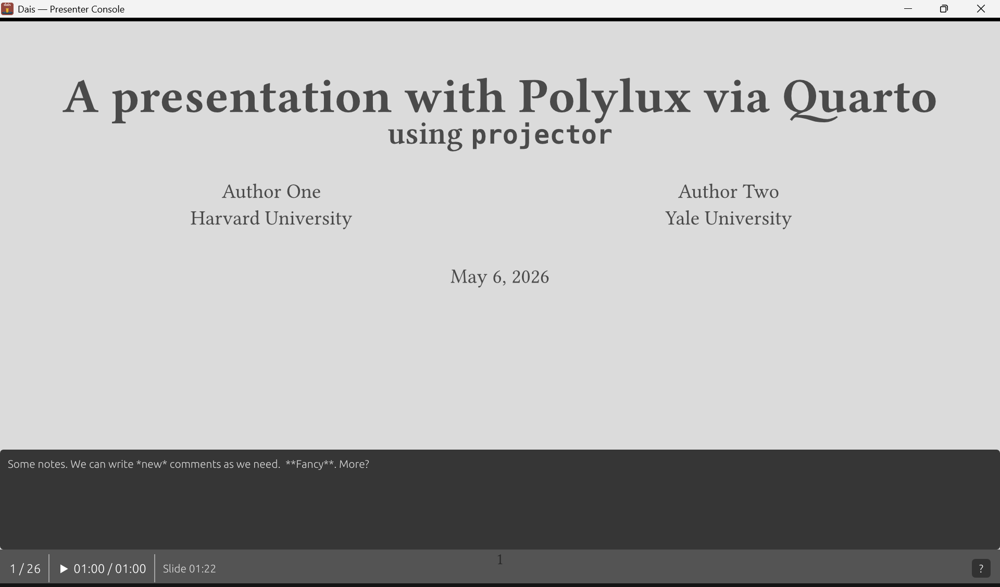

For Zoom or Teams, `dais --screen-share` makes the audience view a normal resizable window you can share.
This allows you to screen share even on a single laptop screen, without showing your notes to the world.

## Slide navigation

The arrow keys, , and / all navigate slides.
 and  jump to the first and last slide, respectively.
To jump directly to a slide by number, press :

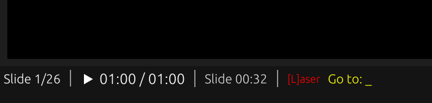

Pressing  opens a navigation overlay.
This includes a mini version of each slide, without changing the audience view.

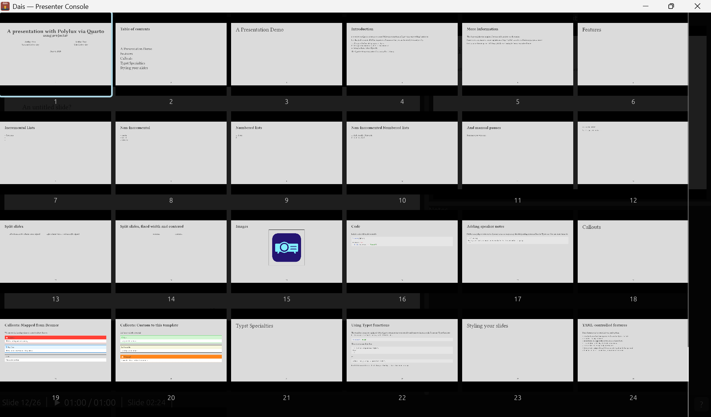

## Slide groups

Slides made with Beamer or Typst (see [Polylux](https://typst.app/universe/package/polylux/) and [Touying](https://typst.app/universe/package/touying/)) create incremental animations by generating multiple PDF pages per logical slide.
`dais` can ingest `.pdfpc` files to reconstruct groups automatically and convert them to `dais`'s format.
The right arrow advances within a slide's incremental steps before moving to the next logical slide.
`dais` will display the step number alongside the slide number:

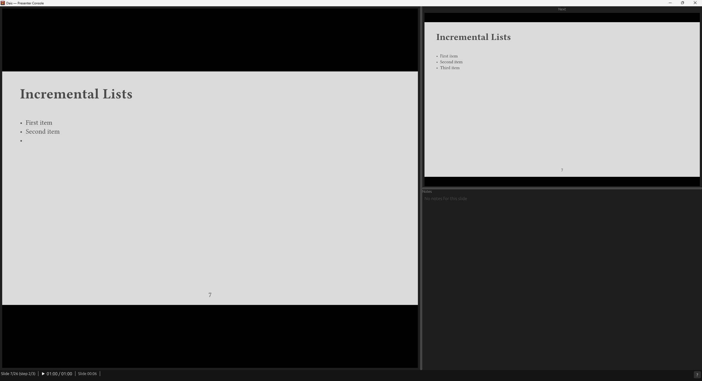

For PDFs without slides metadata or `.pdfpc` files, `dais` includes a grouping editor:

```bash
dais --edit slides.pdf
```

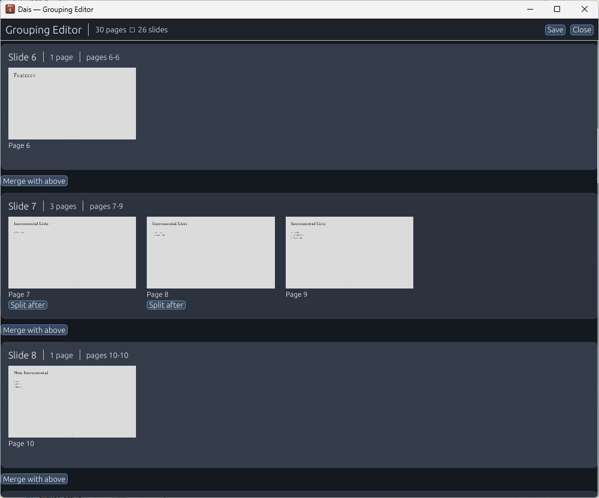

Slides on the same row are treated as incremental slides for counter and navigation purposes.
Groups are saved to a `.dais` sidecar file next to the PDF.

## Presentation tools

### Spotlight

Press  to draw a spotlight square around your cursor on the audience display.

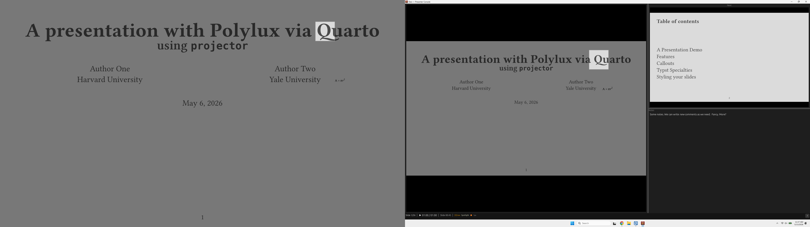

### Zoom

Press  to enter zoom mode.
Scroll the mouse wheel to zoom in more:

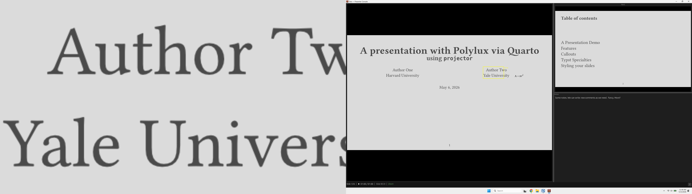

### Laser pointer

Press  to toggle the laser pointer.
 cycles through seven styles: dot, minimal, crosshair, arrow, ring, bullseye, and highlight.
The laser pointer is turned on by default when opening slides.

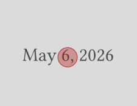

### Freeze and blackout

Press  to freeze the audience display on the current slide while you keep navigating the console.
Press  (or ) to black out the audience entirely.
Advancing past the last slide blacks out automatically.

## Annotations

### Drawing

Press  to toggle freehand ink drawing.
 cycles pen colors,  cycles pen width, and  clears the current slide's ink.

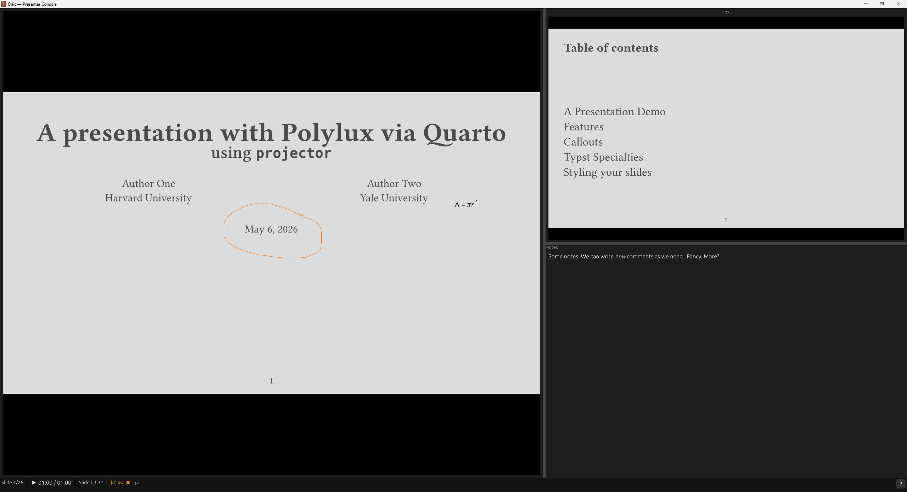

### Text boxes

Press  to enter text box placement mode, then click on the slide to place a box.
Text boxes are rendered with [Typst](https://typst.app/), so you get full math support.
Typst is a better fit for this type of app because rendering is essentially instant and you never get an overfull hbox.
The background is transparent, but can be configured to match your slide theme's background color.

::: {#fig-text-boxes layout-ncol=2}

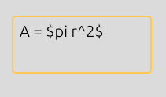{#fig-text-editing}

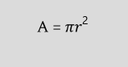{#fig-text-rendered}

Live editing and rendered text.

:::

### Whiteboard

Press  to show a blank canvas on the audience display.
The drawing mode activates automatically.
Drawings on the whiteboard persist across slides and can be saved with  or cleared with .

## Customizing `dais`

Configuration lives in a TOML file.
You can place a `dais.toml` next to any PDF to override settings, like so:

```toml
[display]
audience_monitor = "Projector"

[timer]
mode = "countdown"
duration_minutes = 20
warning_minutes = 5
```

All keybindings are remappable.
The defaults follow expected conventions (/ to navigate), so most USB clickers will work without setup.
Use `dais --test-input` to see exactly what key names your clicker sends:

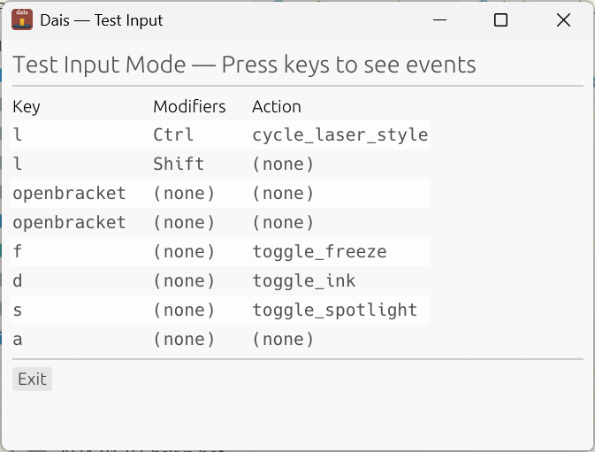

Then add a custom profile:

```toml
[clicker.profiles.my-remote]
PageDown = "next_slide"
PageUp = "previous_slide"
Escape = "toggle_blackout"
```

Full references for [configuration](https://christophertkenny.com/dais/configuration.html) and [keybindings](https://christophertkenny.com/dais/keybindings.html) are in the online docs.

## Want to try it?

Install from [crates.io](https://crates.io/crates/dais) with Cargo:

```bash
cargo install dais
```

To build the development version from GitHub:

```bash
cargo install --git https://github.com/christopherkenny/dais.git --package dais --bin dais
```

Grab a pre-built binary from the [GitHub Releases](https://github.com/christopherkenny/dais/releases) page if you'd rather not install Rust.
I recommend just building it, as downloading a version tends to cause your local device security to yell.
